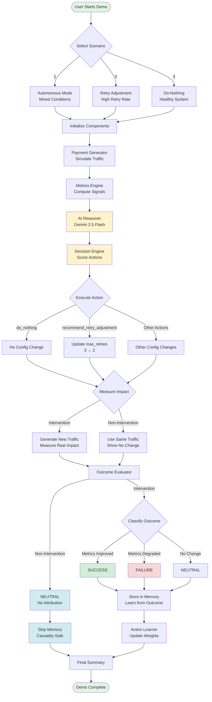
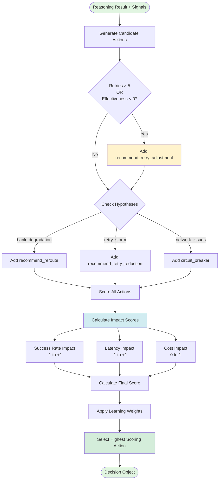
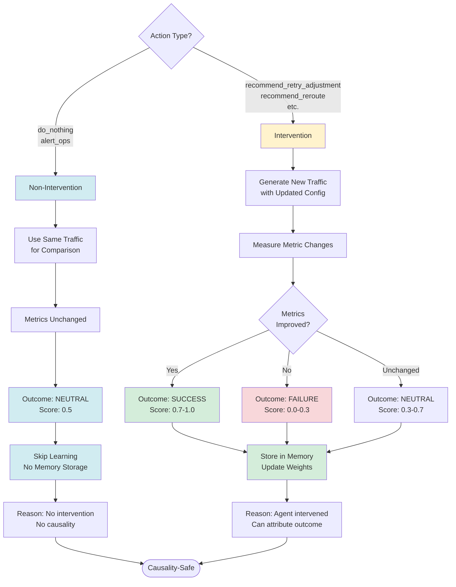
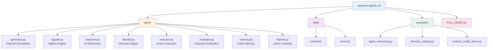

# Payment Routing Agent - Complete Architecture

## 🎯 System Overview

---

## 🔄 Detailed Component Flow

```mermaid
flowchart LR
    subgraph Input["📥 INPUT LAYER"]
        PG[Payment Generator]
        Traffic[Payment Traffic]
    end
    
    subgraph Observe["👁️ OBSERVATION LAYER"]
        ME[Metrics Engine]
        Signals[Payment Signals]
    end
    
    subgraph Reason["🧠 REASONING LAYER"]
        AIR[AI Reasoner<br/>Gemini]
        Hypotheses[Hypotheses]
    end
    
    subgraph Decide["⚖️ DECISION LAYER"]
        DE[Decision Engine]
        Candidates[Candidate Actions]
        Scoring[Action Scoring]
        Selection[Best Action]
    end
    
    subgraph Execute["⚡ EXECUTION LAYER"]
        AE[Action Executor]
        Config[Runtime Config]
    end
    
    subgraph Measure["📊 MEASUREMENT LAYER"]
        PostTraffic[Post-Action Traffic]
        PostMetrics[Post-Action Metrics]
    end
    
    subgraph Evaluate["✅ EVALUATION LAYER"]
        OE[Outcome Evaluator]
        Classification[Outcome Classification]
    end
    
    subgraph Learn["🎓 LEARNING LAYER"]
        Memory[Action Memory]
        Learner[Action Learner]
        Weights[Action Weights]
    end
    
    PG --> Traffic
    Traffic --> ME
    ME --> Signals
    Signals --> AIR
    AIR --> Hypotheses
    Hypotheses --> DE
    DE --> Candidates
    Candidates --> Scoring
    Scoring --> Selection
    Selection --> AE
    AE --> Config
    Config --> PostTraffic
    PostTraffic --> PostMetrics
    PostMetrics --> OE
    OE --> Classification
    Classification --> Memory
    Memory --> Learner
    Learner --> Weights
    Weights -.Feedback.-> DE
    
    style Input fill:#e3f2fd
    style Observe fill:#fff3e0
    style Reason fill:#f3e5f5
    style Decide fill:#e8f5e9
    style Execute fill:#fce4ec
    style Measure fill:#e0f2f1
    style Evaluate fill:#fff9c4
    style Learn fill:#f1f8e9
```

---

## 🔍 Decision Engine Detail

---

## ⚖️ Causality-Safe Learning

---

## 📁 Project Structure

---

## 🎯 Key Features

### ✅ Honest Agent Behavior
- No forced actions
- No decision overrides
- Scenario controls only initial conditions
- Agent logic remains autonomous

### ✅ Causality-Safe Learning
- Non-intervention actions → NEUTRAL outcome
- No false attribution of metric changes
- Learning only from actual interventions
- Natural variance not credited to agent

### ✅ Realistic Simulation
- Proportional impact modeling
- Config change 3→2 = 33% retry reduction
- Believable metric improvements
- No miraculous changes

---

**Complete autonomous agent with full observability and learning!** 🎉
