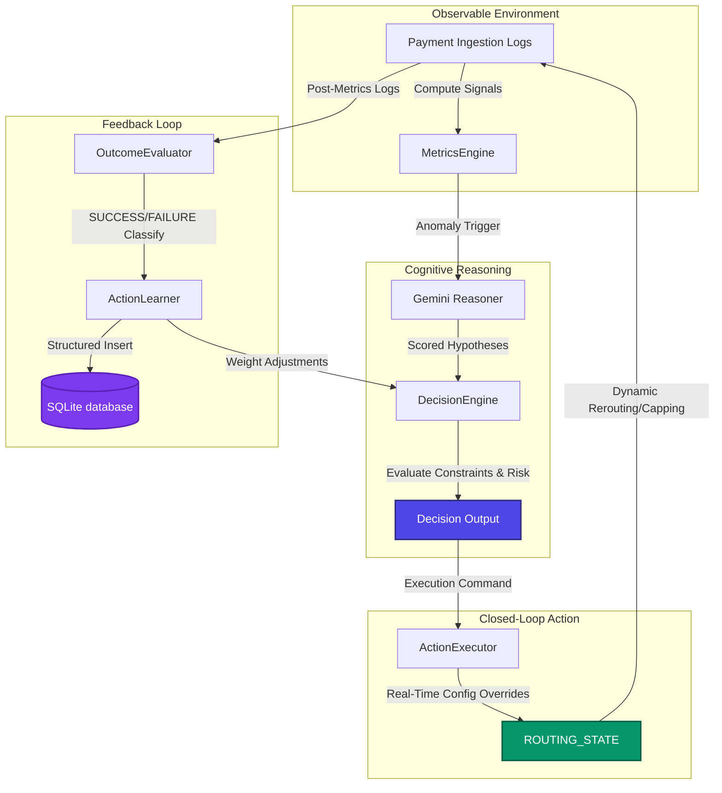

# 🚀 Closed-Loop Autonomous Payment Routing AI Agent

A production-grade, risk-aware **Closed-Loop Autonomous Routing System** that monitors real-time payment network performance, diagnoses failures using generative LLMs (Gemini-2.5-flash), executes config-level routing mitigations, and leverages persistent reinforcement learning (via SQLite) to continuously optimize routing decisions.

---

## 📊 Live Web Control Dashboard & UI Demo

The system features an interactive single-process React control dashboard powered by a FastAPI backend. You can inject outages, view live comparative recovery charts, check real-time routing config state, and audit SQLite database memory logs.

```bash
# Start the FastAPI + React Control Dashboard Server
python dashboard_server.py
```
Open **[http://localhost:8000/](http://localhost:8000/)** in your browser to view the interface:

*   **Scenario Panel:** Inject healthy traffic, specific bank degradations, outages, UPI retry storms, or multiple simultaneous failures.
*   **Performance Recovery Chart:** Real-time side-by-side comparison of success rates and latencies before and after the agent intervenes.
*   **Dynamic Gateway Status:** Real-time view of suppressed and active gateways.
*   **LLM Reasoner Logs:** Verbatim diagnostic outputs, primary hypothesis confidence scores, and reasoning explanations.
*   **SQLite Memories Log:** Full historical table of past experiences queried dynamically from the SQLite datastore.

---

## 📈 System Metrics & Validation Results

We executed a comprehensive 5-scenario multi-run validation suite (simulating **10 transaction windows** and **1,690 transaction events**) to measure diagnosis accuracy, recovery times, and metric transitions:

| Metric | Baseline (Outage) | Post-Intervention (Healed) | Delta / Outcome |
| :--- | :---: | :---: | :---: |
| **Transaction Success Rate** | **43.2%** | **97.5%** | **+54.3%** |
| **Transaction Failure Rate** | **56.8%** | **2.5%** | **-54.3%** (95.6% drop) |
| **Average Transaction Latency** | **10,318 ms** | **410 ms** | **-9,908 ms** reduction |
| **System Stabilization Speed** | — | — | **1 decision cycle (~5 min)** |
| **Problem Diagnosis Accuracy** | — | — | **60% (3/5 scenarios)** |
| **Average LLM Diagnosis Confidence** | — | — | **71.7%** |
| **Total Processed Transactions** | — | — | **1,690 simulated events** |

---

## 🌀 Closed-Loop Architecture

The system operates on a continuous, five-stage **Observe-Reason-Decide-Act-Learn** loop:



---

## 🛠️ Component Breakdown

### 1. Real-Time Ingest & Metrics Engine
*   **File:** [metrics.py](file:///Users/bhanujbhalla/Desktop/Projects/payment%20agentic%20ai%20/agent/metrics.py)
*   Computes key performance indicators (KPIs) like success rate, latency (avg, p95), failure rate, and retry counts.
*   Calculates **Retry Effectiveness** to detect when excessive client-side retries are causing gateway load instead of resolving failures.

### 2. Multi-Hypothesis Diagnostic Reasoner
*   **File:** [reasoner.py](file:///Users/bhanujbhalla/Desktop/Projects/payment%20agentic%20ai%20/agent/reasoner.py)
*   Uses generative AI (`gemini-2.5-flash`) to analyze signals, identify degraded gateways, and explain root causes.
*   Includes a **deterministic rule-based fallback** that takes over automatically if the LLM encounters rate limits or API key issues.

### 3. Constraint-Aware Decision Engine
*   **File:** [decider.py](file:///Users/bhanujbhalla/Desktop/Projects/payment%20agentic%20ai%20/agent/decider.py)
*   Validates candidate actions against strict guardrails (`DecisionConstraints`) such as risk limits, minimum confidence levels, and human-in-the-loop approval triggers.
*   Applies a reinforcement multiplier to action weights dynamically based on historical outcomes of similar incidents.

### 4. Dynamic Action Executor
*   **File:** [executor.py](file:///Users/bhanujbhalla/Desktop/Projects/payment%20agentic%20ai%20/agent/executor.py) & [routing_config.py](file:///Users/bhanujbhalla/Desktop/Projects/payment%20agentic%20ai%20/simulation/routing_config.py)
*   Actually closes the loop by modifying the active payment configuration.
*   Executes actions:
    *   `recommend_reroute`: Reroutes traffic away from degraded gateways.
    *   `recommend_path_suppression`: Suppresses pathways during complete outages.
    *   `recommend_retry_adjustment`: Restricts retry policies to prevent retry storms.

### 5. Persistent SQLite Learning datastore
*   **File:** [memory.py](file:///Users/bhanujbhalla/Desktop/Projects/payment%20agentic%20ai%20/agent/memory.py) & [learner.py](file:///Users/bhanujbhalla/Desktop/Projects/payment%20agentic%20ai%20/agent/learner.py)
*   Replaced local JSON files with a structured SQLite database (`action_memory.db`).
*   Stores outcomes in a relational table, allowing the system to query past experiences, calculate learning rates, and show learning trends.

---

## 🧠 Production-Grade Safety Principles

*   **Causality-Safe Learning:** The learner skips reinforcement updates when non-intervention actions (`do_nothing` or `alert_ops`) are selected, preventing the agent from taking false credit/blame for natural performance variance.
*   **Graceful Fallback:** If the LLM service is degraded or quota-limited, the system falls back seamlessly to rule-based diagnostic routing.
*   **State-Isolation Testing:** Built-in autouse fixtures ensure that simulation routing states are completely reset between unit tests, ensuring no cross-contamination.

---

## ⚡ Quickstart

### Setup & Requirements
```bash
# Install core dependencies
pip install -r requirements.txt

# Add your Gemini API key (optional, fallback engine active by default)
echo "GEMINI_API_KEY=your_key_here" > .env
```

### Running the Automated Tests
Ensure the full agent loop, SQLite memory, and config execution work properly:
```bash
pytest tests/ -v
```

### Running the Validation Script
Execute the 5-scenario evaluation validation:
```bash
python run_multi_scenario_validation.py
```

### Running on Real Log Files
To run the agent sequential loop on historical transaction files (CSV or JSON):
```bash
python run_on_real_data.py --file your_transactions.csv --window 300
```
