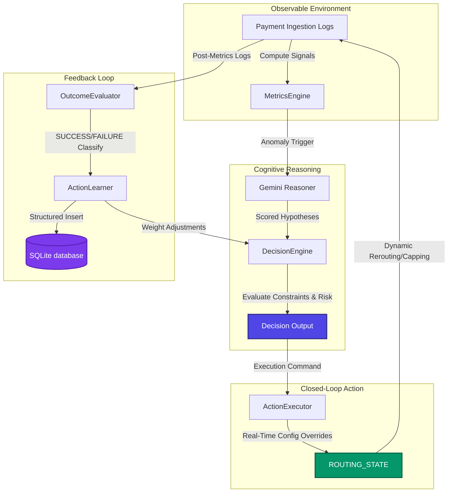

# 🚀 Closed-Loop Autonomous Payment Routing AI Agent

A production-grade, risk-aware **Closed-Loop Autonomous Routing System** that monitors real-time payment network performance, classifies failures with deterministic rules (Gemini-2.5-flash writes the plain-English explanation), executes config-level routing mitigations on a simulated payment network, and uses outcome history persisted in SQLite to nudge future decisions (bounded ±20%).

Built to demonstrate what an AI-native reliability layer for a payments platform looks like end-to-end: **detect → diagnose → decide → act → learn**, with a human-approval gate on high-risk actions and a full audit trail of every decision.

   

---

## 🖥️ Live Demo — Self-Explaining Control Dashboard

The system ships with an interactive **FastAPI + React control dashboard** (single process, zero build step) so the entire closed loop can be triggered and inspected from a browser — and every part of the screen is **tagged with the pipeline stage it belongs to**, so you always know whether you're looking at what the system *observed*, *reasoned*, *decided*, *acted on*, or *learned*.

```bash
# Start the FastAPI + React Control Dashboard Server
python dashboard_server.py
```
Open **[http://localhost:8000/](http://localhost:8000/)** and you land on a **Home page** that explains the whole product before you touch anything — a live walkthrough of all five stages, each with its own screenshot and colored badge (①Observe ②Reason ③Decide ④Act ⑤Learn), plus a feature grid and one-click links into the live demo.

Then in the **Control Center**, the same five badges appear directly on the real results of a scenario run — a real HDFC Bank outage, classified by the rule engine and explained by Gemini, resolved automatically, and its outcome persisted to SQLite:


*Every card is labeled: ① OBSERVE (the baseline vs. healed metrics MetricsEngine computed), ② REASON (rule-based classification and confidence, with a Gemini-written explanation), ③ DECIDE (the decision engine's chosen action, risk level, and rationale), ④ ACT (the live routing config the executor actually mutated), ⑤ LEARN (the outcome score persisted to SQLite). Nothing here is mocked — this is a real request/response cycle.*

Every intervention is written to a real SQLite database and surfaced in the **SQLite Memories** tab, so the learning signal is auditable, not a black box:


What you get, tab by tab:

*   **Home** — a self-explaining landing page: what the product does, a screenshot-illustrated walkthrough of all 5 pipeline stages, a feature grid, and full-dashboard previews.
*   **Control Center** — one-click failure injection (healthy traffic, single-bank degradation, full outage, UPI retry storm, or multiple simultaneous failures), a live KPI strip, and the stage-tagged breakdown of the agent's diagnosis → decision → execution → learning cycle for the last run.
*   **SQLite Memories** — the full historical audit log of every intervention the agent has made, queried live from the database, with baseline vs. post-intervention deltas and outcome scores.
*   **Architecture** — an interactive map of the five-stage pipeline, each stage linked to its real source file, plus the safety guardrails and available routing actions.
*   Toast notifications and a confirm-before-destroy modal for state resets — this is built to be demoed live, not just curl'd.

### The five stages, tagged and screenshotted individually

| ① Observe | ② Reason | ③ Decide |
| :---: | :---: | :---: |
|  |  |  |
| MetricsEngine's pre/post signal | Rule-based diagnosis + Gemini explanation | The decision engine's chosen action |

| ④ Act | ⑤ Learn |
| :---: | :---: |
|  |  |
| The live routing config actually mutated | Outcome scored and persisted to SQLite |

---

## 📈 System Metrics & Validation Results

> Scope note: everything runs against a **simulated** payment network (seeded traffic generator), not real bank traffic. Diagnosis accuracy was 60% (3/5) — the retry-storm scenario is currently classified as `network_issues`, though the chosen retry-cap action still recovers it.

We executed a comprehensive 5-scenario multi-run validation suite (simulating **10 transaction windows** and **1,690 transaction events**) to measure diagnosis accuracy, recovery times, and metric transitions. These numbers come straight from [`run_multi_scenario_validation.py`](run_multi_scenario_validation.py) — re-run it yourself to reproduce them:

| Metric | Baseline (Outage) | Post-Intervention (Healed) | Delta / Outcome |
| :--- | :---: | :---: | :---: |
| **Transaction Success Rate** | **43.2%** | **97.5%** | **+54.3%** |
| **Transaction Failure Rate** | **56.8%** | **2.5%** | **-54.3%** (95.6% drop) |
| **Average Transaction Latency** | **10,318 ms** | **410 ms** | **-9,908 ms** reduction |
| **System Stabilization Speed** | — | — | **1 decision cycle (~5 min)** |
| **Problem Diagnosis Accuracy** | — | — | **60% (3/5 scenarios)** |
| **Average LLM Diagnosis Confidence** | — | — | **71.7%** |
| **Total Processed Transactions** | — | — | **1,690 simulated events** |

**Test suite:** 88/88 unit and integration tests passing (`pytest tests/ -v`) covering the metrics engine, reasoner, decision engine, executor, evaluator, memory/learning layer, and end-to-end agent loop.

---

## 🌀 Closed-Loop Architecture

The system operates on a continuous, five-stage **Observe → Reason → Decide → Act → Learn** loop:


```mermaid
graph TD
    subgraph Observable Environment
        A[Payment Ingestion Logs] -->|Compute Signals| B[MetricsEngine]
    end

    subgraph Cognitive Reasoning
        B -->|Anomaly Trigger| C[Gemini Reasoner]
        C -->|Scored Hypotheses| D[DecisionEngine]
        D -->|Evaluate Constraints & Risk| E[Decision Output]
    end

    subgraph Closed-Loop Action
        E -->|Execution Command| F[ActionExecutor]
        F -->|Real-Time Config Overrides| G[ROUTING_STATE]
        G -->|Dynamic Rerouting/Capping| A
    end

    subgraph Feedback Loop
        A -->|Post-Metrics Logs| H[OutcomeEvaluator]
        H -->|SUCCESS/FAILURE Classify| I[ActionLearner]
        I -->|Weight Adjustments| D
        I -->|Structured Insert| J[(SQLite database)]
    end

    style E fill:#4f46e5,stroke:#312e81,stroke-width:2px,color:#fff
    style G fill:#059669,stroke:#065f46,stroke-width:2px,color:#fff
    style J fill:#7c3aed,stroke:#5b21b6,stroke-width:2px,color:#fff
```

The **Architecture** tab in the live dashboard renders this same pipeline interactively, with each stage linked to its source file.

---

## 🛠️ Component Breakdown

### 1. Real-Time Ingest & Metrics Engine
*   **File:** [agent/metrics.py](agent/metrics.py)
*   Computes key performance indicators (KPIs) like success rate, latency (avg, p95), failure rate, and retry counts.
*   Calculates **Retry Effectiveness** to detect when excessive client-side retries are causing gateway load instead of resolving failures.

### 2. Multi-Hypothesis Diagnostic Reasoner
*   **File:** [agent/reasoner.py](agent/reasoner.py)
*   Uses generative AI (`gemini-2.5-flash`) to analyze signals, identify degraded gateways, and explain root causes.
*   Includes a **deterministic rule-based fallback** that takes over automatically if the LLM encounters rate limits or API key issues.

### 3. Constraint-Aware Decision Engine
*   **File:** [agent/decider.py](agent/decider.py)
*   Validates candidate actions against strict guardrails (`DecisionConstraints`) such as risk limits, minimum confidence levels, and human-in-the-loop approval triggers.
*   Applies a bounded (±20%) adjustment to action scores based on similar past outcomes (needs ≥2 samples). In the dashboard this history is per visitor session.

### 4. Dynamic Action Executor
*   **File:** [agent/executor.py](agent/executor.py) & [simulation/routing_config.py](simulation/routing_config.py)
*   Actually closes the loop by modifying the active payment configuration.
*   Executes actions:
    *   `recommend_reroute`: Reroutes traffic away from degraded gateways.
    *   `recommend_path_suppression`: Suppresses pathways during complete outages.
    *   `recommend_retry_adjustment`: Restricts retry policies to prevent retry storms.

### 5. Persistent SQLite Learning Datastore
*   **File:** [agent/memory.py](agent/memory.py) & [agent/learner.py](agent/learner.py)
*   Replaced local JSON files with a structured SQLite database (`action_memory.db`).
*   Stores outcomes in a relational table, allowing the system to query past experiences, calculate learning rates, and show learning trends.

### 6. Control Dashboard
*   **File:** [dashboard_server.py](dashboard_server.py)
*   A single-file FastAPI backend serving a React 18 + Tailwind single-page app (no build step — Babel-in-browser).
*   Exposes `/api/metrics`, `/api/history`, `/api/reset`, and `/api/run_scenario` so the entire closed loop can be triggered and inspected live.

---

## 🧠 Production-Grade Safety Principles

*   **Causality-Safe Learning:** The learner skips reinforcement updates when non-intervention actions (`do_nothing` or `alert_ops`) are selected, preventing the agent from taking false credit/blame for natural performance variance.
*   **Graceful Fallback:** Classification never depends on the LLM. If Gemini is degraded or quota-limited, a rule-based explanation is used; recent identical Gemini answers are cached to stay inside the free quota.
*   **Session Isolation & Rate Limiting:** Each visitor gets an isolated routing state and SQLite memory (cookie-scoped, auto-pruned), and the endpoints that call Gemini are rate limited per IP.
*   **Risk-Gated Execution:** High-risk actions (e.g. full path suppression) are flagged `PENDING_HUMAN_APPROVAL` rather than executed blindly.
*   **State-Isolation Testing:** Built-in autouse fixtures ensure that simulation routing states are completely reset between unit tests, ensuring no cross-contamination.

---

## ⚡ Quickstart

### Setup & Requirements
```bash
# Install core dependencies
pip install -r requirements.txt

# Add your Gemini API key (optional, fallback engine active by default)
echo "GEMINI_API_KEY=your_key_here" > .env
```

### Launch the Live Dashboard
```bash
python dashboard_server.py
# then open http://localhost:8000/
```

### Running the Automated Tests
Ensure the full agent loop, SQLite memory, and config execution work properly:
```bash
pytest tests/ -v
```

### Running the Validation Script
Execute the 5-scenario evaluation validation:
```bash
python run_multi_scenario_validation.py
```

### Running on Real Log Files
To run the agent sequential loop on historical transaction files (CSV or JSON):
```bash
python run_on_real_data.py --file your_transactions.csv --window 300
```
